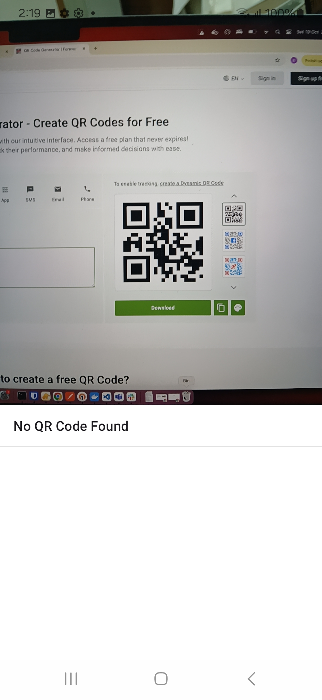

## No QR code found image reference

## With distance image reference

# QR Code Distance Detection App

## Project Description

This app is designed to detect QR codes using the device's camera and calculate the distance between the camera and the QR code. The app requires mandatory **Camera** permissions to function properly. The size of the QR code is fixed at **50 mm** by default.

### Key Features:
- Detects QR codes using the device's camera.
- Calculates the distance between the real device camera and the QR code.
- Default QR code size: **50 mm**.

## System Requirements

To run this project, ensure that your system meets the following requirements:

- **JDK Version**: 17
- **Minimum SDK**: 28
- **Maximum SDK**: 34

## Permissions

This app requires the following permission:
- **Camera**: This permission is mandatory to allow the app to detect QR codes using the device's camera.

## How to Run

1. Ensure you have the required JDK version (17) installed.
2. Clone the project repository.
3. Open the project in your preferred IDE (e.g., Android Studio).
4. Set the minimum SDK to 28 and the maximum SDK to 34.
5. Grant the required **Camera** permission when prompted.
6. Build and run the project on an Android device that meets the SDK requirements.

## Notes

- The default size of the QR code used for detection is **50 mm**. Please ensure that the QR code you are scanning is approximately the same size for accurate distance measurements.

